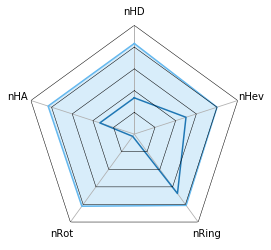
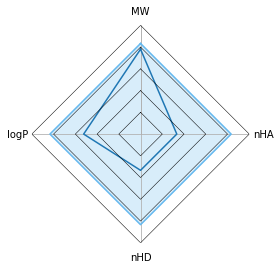
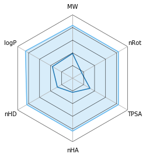
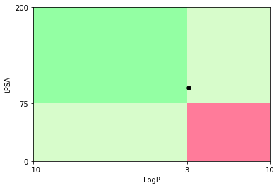
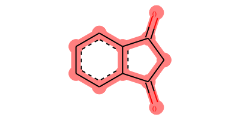

# Scopy: a compounds filter for early stages drug discovery.

<div align=center>
    
</div>

## What's it is

**Scopy(<font color='red'>S</font>creening <font color='red'>CO</font>mpounds)**, based on RDKit, is an open-source virtual screening tool. Its calculation is based on the various drug-likeness rules and many **unexpected substructure** presented in **SMARTS** format. Besides, Scopy could also compute some **fingerprints** that retrieved from  **structures**

## Main Function

### Checking molecule under drug-likeness rules

Drug-likeness rules are set of guidelines for the structural properties of compounds, used for fast calculation of drug-like properties of a molecule. These guidelines are not absolute, nor are they intended to form strict cutoff values for which property values are drug-like and which are not drug-like. Nevertheless, they can be quite effective and efficient.

#### Physicochemical Properties

In order to implement checking molecule under drug-likeness rules, physicochemical properties should be calculated firstly.

```
This moudle is used to calculated properise that contained in our collectded rules
    ---
    up to now(2019.07.22), we have achived following properties:
        Molcular Weight >>> MW
        Number of bonds >>> nBond
        Number of atoms >>> nAtom
        Number of heteroatoms >>> nHet
        Number of heavy atom >>> nHev
        Number of rotable bonds >>> nRot
        Number of rigid bonds >>> nRig
        Number of SSSR >>> nRing
        logP >>> logP
        logD >>> logD
        logSw >>> logSw
        Acid or Base >>> ab
        pKa >>> pKa
        QED >>> qed
        Molecular refraction >>> MR
        Number of hydrogen bond donors >>> nHD
        Number of hydrogen bond acceptors >>> nHA
        Number of hydrogen bond donors& acceptors >>> nHB
        Aromatic proportion >>> AP
        sp3 hybridized carbons/total carbon count >>> Fsp3
        TPSA >>> TPSA
        Number of atoms involved in the biggest system ring >>> MaxRing
        Number of Sterocenterss >>> nStero
        HetCarbonRatio >>> HetRatio
        synthetic accessibility score >>> SAscore
        natural product-likeness score >>> NPscore
        Number of single bonds >>> nSingle
        Number of double bobds >>> nDoudle
        Number of triple bonds >>> nTriple
        Volume of mol >>> Vol
        Density >>> Dense
        MolFCharge >>> fChar
        Number of Carbon atoms >>> nC
        Number of Boron atoms >>> nB
        Number of Chlorin atoms >>> nCl
        Number of Bromine atoms >>> nBr
        Number of Iodine atoms >>> nI
        Number of Phosphor atoms >>> P
        Number of Sulfur atoms >>> nS
        Number of Oxygen atoms >>> nO
        Number of Nitrogen atoms >>> nN
    ---
    Followed should be achieved in the future:
        Formal total charge of the compound
        Number of Charged Groups
```
This function is implemented in module scopy.druglikeness

```python
>>> from scopy.druglikeness import molproperty
>>> from rdkit import Chem
```

```python
>>> mol = Chem.MolFromSmiles('C1=CC=CC1')
>>> res = molproperty.GetProperties(mol)
>>> print(res)
Properties(MW=66.1, Vol=81.21, Dense=0.81, fChar=0, nBond=5, nAtom=11, nCarbon=5, nHD=0, nHA=0, nHB=0, nHet=0, nStero=0, nHev=5, nRot=0, nRig=5, nRing=1, logP=1.5, logD=1.2081988287461527, pKa=-7.418658028559937, logSw=-1.21, ab='base', MR=22.9, tPSA=0.0, AP=0.0, HetRatio=0.0, Fsp3=0.2, MaxRing=5, QED=0.4, SAscore=3.31, NPscore=2.16, nSingle=3, nDouble=2, nTriple=0, nC=5, nB=0, nF=0, nCl=0, nBr=0, nI=0, nP=0, nS=0, nO=0, nN=0)
```

You could also compute each property respectively, like:

```python
>>> mol = Chem.MolFromSmiles('C1=CC=CC2C=CC3C4C=CC=CC=4C=CC=3C1=2')
>>> res_1 = molproperty.CalculateLogP(mol)
>>> res_2 = molproperty.CalculateNumHAcceptors(mol)
>>> res_3 = molproperty.CalculateNumRing(mol)
>>> print(res_1,res_2,res_3)
5.15 0 4
```

#### Drug-likeness Rules

```
up to now(2019.07.09), we have achived following rules:
    Egan Rule     0<=tPSA<=132; -1<=logP<=6
    Veber Rule   nRot<= 10; tPSA<= 140; nHB<= 12
    LipinskiRule  MW<=500; logP<=5, nHD<=5, nHA <=10
    BeyondRo5   Mw<=1000; -2<=logP<=10; nHD<=6, nHA<=15; tPSA<=250; nRot<=20
    Pfizer Rule     logP>3; PSA<75
    GSK Rule        MW<=400; logP<=4
    OralMacrocycles     MW<1000; logP<10; nHD<5; PSA<250
    Oprea Rule   nRing>=3,nRig>=18,nRot>=6  
    Ghose Rule      -0.4<logP<5.6; 160<MW<480; 40<MR<130; 20<nAtom<70
    Xu Rule     nHD<=5; nHA <= 10; 3 <= rot <= 35; 1 <= nring <= 7; 10 <= nhev <= 50
    Ro4 Rule    MW<=400; logP<=4; nHD<=4; NHA<=8; PSA<=120
    Ro3 Rule    MW<=300; -3<=logP<=3; nHD<=3; nHA<=6; PSA<=60
    Ro2 Rule    MW<=200; logP<=2; nHD<=2; nHA<=4
---
Followed should be achieved in the future:
    OpreaTwo Rule
    Kelder Rule
    REOS Rule
    GoldenTriangle
    Schneider Rule
    DrugLikeOne
    DrugLikeTwo
    Zinc
    Cns
    Respiratory
```

this function is realized in module scopy.druglikeness

```python
>>> from scopy.druglikeness import rulesfilter
>>> from rdkit import Chem

>>> mol = Chem.MolFromSmiles('C1=CC=CC2C=CC3C4C=CC=CC=4C=CC=3C1=2')
>>> res = rulesfilter.CheckLipinskiRule(mol)
>>> print(res)
LipinskiRule(Disposed='Accepted', nViolate=1)
```

The filed 'Disposed' is meant molecular state after rule applied. 'Accepted' means obey the rule. attribute 'nViolated' means the number of violated requirement of a rule.

If you want to get specific properties suggested in rule, you could pass the <code>True</code>  to Parameter 'detail'(default: False)

```python
>>> res = rulesfilter.CheckLipinskiRule(mol,detail=True)
>>> print(res)
LipinskiRule(MW=228.29, logP=5.15, nHD=0, nHA=0, Disposed='Accept', nViolated=1)
```

Customized rules are also supported

```python
>>> res = rulesfilter.Check_CustomizeRule(mol,prop_kws={'MW':(None,500),
                                                  'nRing':(1,5),
                                                  'nHB':(1,5)},
                                        	detail=True,closed_interval=False)
>>> print(res)
CustomizeRule(MW=228.29, nRing=4, nHB=0, nViolate=1, VioProp=['nHB'])
```

#### Visualize Rules

Some rules could be visualized

```
up to now(2019.07.20), following rules could be visualized:
	BeyondRo5 rule
	Lipinski rule
	Xu'rule
	Pfizer's rule
```

```python
>>> from scopy.druglikeness import visualize
>>> mol = Chem.MolFromSmiles('Fc1ccc(CC2=NNC(=O)c3ccccc23)cc1C(=O)N4CCc5cccc6C(=O)NCC4c56')
```

```python
>>> visualize.VisualizeXu(mol)
>>> visualize.VisualizeLipinski(mol)
>>> visualize.VisualizeBeyondRo5(mol)
```

<div align=left>
    
    
    
</div>

radar plot, the compounds values are materialized by the blue line, which should fall within the optimal pale blue.

```python
>>> visualize.PfizerPositioning(mol)
```

<div align=left>
    
</div>

### Checking molecule under predefined substructures

The filters consist of a series of molecular query strings written using the SMARTS coding language described by [Daylight](https://www.daylight.com/). 

```python
"""
---
Up to now(2019.07.02), we have collected followed endpoints(the number of SMARTS):
	Acute_Aquatic_Toxicity(99)
	AlphaScreen_FHs(6)
	AlphaScreen_GST_FHs(34)
	AlphaScreen_HIS_FHs(19)
	Biodegradable(9)
	BMS(180)
	Chelating(55)
	Developmental_Mitochondrial(12)
	Genotoxic_Carcinogenicity_Mutagenicity(117)
	Idiosyncratic(35)
	LD50_oral(20)
	Luciferase_Inhibitory(3)
	NonBiodegradable(19)
	NonGenotoxic_Carcinogenicity(23)
	NTD(105)
	Pains(480)
	Potential_Electrophilic(119)
	Promiscuity(177)
	Reactive_Unstable_Toxic(335)
	Skin_Sensitization(155)
	SureChEMBL(165)
---	
Total: 23 endpints with 2167 SMARTS
"""
```

This function is implemented in module scopy.structure_alert

```python
>>> from scopy.structure_alert import FliterWithSmarts
>>> smis = [
            'C1=CC=C2C(=O)CC(=O)C2=C1', #Pains
            'C1=CC=CC(COCO)=C1', #Potential_Electrophilic
            'N1=NC=CN1C=O', #Promiscuity
            'CC(=O)OC(=O)C1C=COC1', #Skin_Sensitization
            'S',
            'CCCCC(=O)[H]', #Biodegradable
            'C1=CN=C(C(=O)O)C=C1', #Chelating
            'C(OC)1=CC=C2OCC3OC4C=C(OC)C=CC=4C(=O)C3C2=C1',
            'C1=C2N=CC=NC2=C2N=CNC2=C1', #Genotoxic_Carcinogenicity_Mutagenicity
            'N(CC)(CCCCC)C(=S)N', #Idiosyncratic
            ]
>>> mols = (Chem.MolFromSmiles(x) for x in smis)
>>> res = Check_PAINS(mols=mols)
>>> print(res)
```

```python
>>>	[CheckRes(Disposed=False, Endpoint='Pains'), CheckRes(Disposed=True, 				Endpoint='Pains'), CheckRes(Disposed=True, Endpoint='Pains'), CheckRes(Disposed=True, 	Endpoint='Pains'), CheckRes(Disposed=True, Endpoint='Pains'), CheckRes(Disposed=True, 	Endpoint='Pains'), CheckRes(Disposed=True, Endpoint='Pains'), CheckRes(Disposed=True, 	Endpoint='Pains'), CheckRes(Disposed=True, Endpoint='Pains'), CheckRes(Disposed=True, 	Endpoint='Pains')]
```

parametermols if Iterable object(like .sdf), each element is a rdkit.Chem.rdchem.Mol

The filed 'Disposed' is meant molecular state after filter applied. <code>True</code> meant unmatched any SMARTS in the specific endpoint. For <code>False</code>, at least one SMARTS to be matched.

Similarly, you could pass <code>True</code> to parameter <code>detail</code> show to get more information.

```python
>>> mols = (Chem.MolFromSmiles(x) for x in smis)
>>> res = Check_PAINS(mols=mols, detail=True)
>>> print(res)
```

```python
>>>	[CheckRes(Disposed=False, MatchedAtoms=[((0, 1, 2, 3, 4, 5, 6, 7, 8, 9, 10),)], 	MatchedNames=['Keto_keto_beta_A'], Endpoint='Pains'), CheckRes(Disposed=True, 			MatchedAtoms=['-'], MatchedNames=['-'], Endpoint='Pains'), CheckRes(Disposed=True, 		MatchedAtoms=['-'], MatchedNames=['-'], Endpoint='Pains'), CheckRes(Disposed=True, 		MatchedAtoms=['-'], MatchedNames=['-'], Endpoint='Pains'), CheckRes(Disposed=True, 		MatchedAtoms=['-'], MatchedNames=['-'], Endpoint='Pains'), CheckRes(Disposed=True, 		MatchedAtoms=['-'], MatchedNames=['-'], Endpoint='Pains'), CheckRes(Disposed=True, 		MatchedAtoms=['-'], MatchedNames=['-'], Endpoint='Pains'), CheckRes(Disposed=True, 		MatchedAtoms=['-'], MatchedNames=['-'], Endpoint='Pains'), CheckRes(Disposed=True, 		MatchedAtoms=['-'], MatchedNames=['-'], Endpoint='Pains'), CheckRes(Disposed=True, 		MatchedAtoms=['-'], MatchedNames=['-'], Endpoint='Pains')]
```

"MatchedAtoms" shown which atoms has matched SMARTS. "MatchedNames" is the name or code of SMARTS. You could find it in the folder <code>*/Scopy/data/SMARTS</code>

### Visualization

If you get the index of atoms, you could highlight them

```python
>>> mol = Chem.MolFromSmiles('C1=CC=C2C(=O)CC(=O)C2=C1')
>>> pic = VisualizeFragment(mol,(0, 1, 2, 3, 4, 5, 6, 7, 8, 9, 10))
>>> pic
```


<div align=left>
    
</div>

# Copyright (C) 2015-2019 CBDD Group